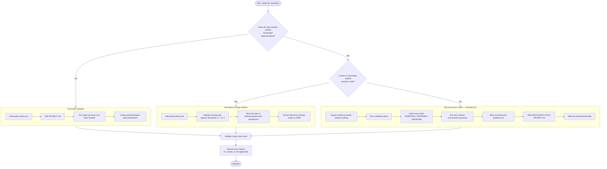

# INSTRUCTIONS — how to adopt and use these standards

**Operator-facing.** This document tells a human or an agent how to consume this repository from
another project. It deliberately does **not** restate the 44 standards — those are in
[`standards/`](standards/), and each one states its own requirements. This is the workflow around
them.

> **Do not copy the standards documents into your repository.** Reference the standards version in
> your `project-policy.yml` and keep only project-specific declarations locally. A copied standard is
> a second definition that will drift from this one, silently, and the drift is only discovered when
> two projects disagree about what a rule means. This is the failure
> [ADR 0002](artifacts/adr/0002-canonical-rule-identity.md) and
> [Standard 37](standards/37-quality-bar.md) R5 exist to prevent.

---

## Minimum adoption recipe

```bash
# 1. Add a project policy
cp <standards-repo>/templates/project-policy.yml ./project-policy.yml

# 2. Validate the policy — this checks its shape, not your compliance
node <standards-repo>/scripts/policy.mjs ./project-policy.yml

# 3. Create the required project artifacts
cp <standards-repo>/templates/PROJECT.md ./PROJECT.md
mkdir -p artifacts/project-plan-breakdown artifacts/adr

# 4. Run the planning and documentation workflows
#    /plan-structure  /plan-handoff  /codebase-docs

# 5. Audit, then resolve every finding: fix it, except it, or declare it not applicable
node <standards-repo>/scripts/standards.mjs audit .
```

**On the command name.** [Standard 23](standards/23-standards-validator-cli.md) R2 names
`standards validate` as the canonical command. The implementation currently ships `standards audit`,
and this document names what actually runs rather than what is specified — a recipe documenting a
command that does not exist is a defect
([Standard 32](standards/32-documentation-quality.md) R3), not a forward-looking convenience. The
rename is an open item.

---

## 1. What this repository is

A numbered series of 44 engineering standards, each a normative document stating what compliant work
must look like, plus the tooling that checks a repository against them.

| Part | Role |
| --- | --- |
| [`standards/`](standards/) | What the rules mean. One document per standard, `01`–`44` |
| [`schemas/`](schemas/) | What a valid policy looks like ([Standard 19](standards/19-json-schema.md)) |
| [`templates/`](templates/) | What to create in your project |
| [`scripts/`](scripts/) | How it is enforced |
| [`artifacts/adr/`](artifacts/adr/) | Decisions that changed the framework |
| **This file** | How to use all of it |

The executable procedures — planning, handoff, documentation, reconstruction — live as global Claude
Code skills rather than in this repository, so they work in any project without installation.

## 2. When another project should use it

When the project is expected to be operated by both humans and AI agents, and to survive the loss of
the conversation that built it. Concretely, adopt these standards when you need any of:

- A fresh engineer or agent to continue work from the repository alone
- Machine-readable declarations of what the project is held to
- Traceability of who or what changed something, and why
- A mechanical answer to "is this done"

A throwaway script does not need this. A system somebody will inherit does.

## 3. Declaring the standards version

One line in `project-policy.yml`:

```yaml
standardVersion: "1.0.0"
```

This pins which rules apply to you. A validator MUST evaluate against the rules in force in *that*
version ([Standard 27](standards/27-rule-catalog.md) R5) — without the pin, a new rule published
upstream would silently make your project non-compliant overnight.

An unresolvable version is a **configuration error**, not a compliance failure
([Standard 21](standards/21-versioning.md) R5).

## 4. Adding `project-policy.yml`

Copy [`templates/project-policy.yml`](templates/project-policy.yml) to your repository root and edit
it. It is a starting point, not a default — a policy nobody edited declares nothing about your
project.

Three constraints the schema enforces immediately:

- **Rule IDs are canonical kebab-case.** `ai.provider-neutral`, not `ai.providerNeutral`. The
  camelCase spellings in the source specification are legacy aliases; they are reported with their
  replacement and rejected ([ADR 0002](artifacts/adr/0002-canonical-rule-identity.md)).
- **Levels, not booleans.** `required`, `recommended`, `optional`, `forbidden`. `true` cannot express
  a considered partial adoption ([Standard 18](standards/18-machine-readable-project-policy.md) R6).
- **A policy selects and configures standards; it never redefines them**
  ([Standard 18](standards/18-machine-readable-project-policy.md) R1). If you need a rule to mean
  something different, that is an exception or an ADR, not a policy edit.

## 5. Validating the policy

```bash
node <standards-repo>/scripts/policy.mjs ./project-policy.yml
```

| Exit | Means |
| --- | --- |
| `0` | The policy is well-formed and internally consistent |
| `1` | The policy is valid but a compliance condition fails — an expired exception, or a rule declared both not-applicable and excepted |
| `2` | The policy could not be evaluated — unreadable, unparseable, or schema-invalid |

**A valid policy says nothing about whether you comply.** It says the declaration is well-formed.
Compliance comes from an audit run.

## 6. Running the audit

```bash
node <standards-repo>/scripts/standards.mjs audit .          # this repo
node <standards-repo>/scripts/standards.mjs audit ../Other   # another repo
node <standards-repo>/scripts/standards.mjs audit . --json
node <standards-repo>/scripts/standards.mjs audit . --strict
```

`--strict` fails on warnings as well as errors. Use it locally and in a gate you control; think
before making it your only CI signal, because a build that breaks on advisory findings is a build
someone disables ([Standard 28](standards/28-github-actions.md)).

**The audit reads your `project-policy.yml`** and prints a verdict beneath the findings:

```text
Compliance
  Status: COMPLIANT
  Score:  100%  (required-level rules that were evaluated: 9)
  Rules:  12 passed, 0 failed, 0 warning(s), 12 skipped
  Cover:  12 automated, 0 manual-review, 7 not-evaluated
```

**Read the last two lines together.** 100% means every required rule that was *checked* passed; the
coverage line says how many were not checked at all. A rule nothing evaluated is `skipped` — never a
pass, and never a failure.

Without a `project-policy.yml` the status is `NOT_EVALUATED` and the findings are observations rather
than a verdict. That is not a failure state; it means nothing declared what applies here.

## 7. Classifying required / not-applicable / exception

Every rule you do not satisfy is exactly one of three things, and it must be recorded as such
([Standard 34](standards/34-dogfooding.md) R3). **There is no fourth category, and specifically no
*silently absent*.**

| Classification | Means | Where it goes |
| --- | --- | --- |
| **Failure** | The rule applies and is not met. Work is outstanding | Nowhere — it stays visible as a failure |
| **Not applicable** | The rule's subject does not exist in your project | `applicability:`, with a reason and ideally a `revisitWhen` |
| **Exception** | The rule applies, is not met, and that is approved | `exceptions:`, with reason, approver, date, and usually an expiry |

The distinction that matters most: **not-applicable is a claim about your project, not about the
rule.** *We have no background jobs* stops being true the day you add one — which is what
`revisitWhen` records.

**Some rules are non-exemptible.** `security.no-secrets-in-artifacts` and `ai.destructive-approval`
declare this in the catalog, and an exception against either is **rejected, not recorded** — you get
`policy.non-exemptible-rule` from the policy checker and a `NON_COMPLIANT` verdict from the audit. If
such a rule genuinely has no subject in your project, declare it `not-applicable`; that is a
different claim and it is permitted.

Two things to resist:

- **Do not waive an inconvenient rule.** A visible failure is worth more than an approved one, because
  approved failures stop being looked at. This repository's own policy leaves
  `architecture.project-manifest` failing rather than excepting it.
- **Do not lower a level to avoid an exception.** Setting a `required` rule to `optional` achieves the
  same outcome while hiding it, and is the mechanism
  [Standard 18](standards/18-machine-readable-project-policy.md) R1 prohibits.

## 8. Bootstrapping a greenfield project

1. `project-policy.yml` from the template, edited
2. `PROJECT.md` from the template ([Standard 6](standards/06-project-manifest.md))
3. `/plan-structure` then `/plan-handoff`, writing every top-level section to its own file under
   `artifacts/project-plan-breakdown/` ([Standard 35](standards/35-planning-requirements.md))
4. `artifacts/adr/` for decisions ([Standard 11](standards/11-architecture-decision-records.md))
5. `/codebase-docs` once there is something to document
6. Audit, and resolve every finding per section 7

[Standard 33](standards/33-bootstrap-experience.md) specifies a `standards init` that would do steps
1–4 in one command. **It is not built yet** — do these by hand.

## 9. Onboarding an existing project

Follow the flow in section 10. The short version: if the project has a trustworthy plan, normalize
what exists rather than replacing it. If it does not, you are in reconstruction mode and must not
write a plan as though the project were starting now.

Normalizing means: add the policy and manifest, check the existing plan against Standards
[4](standards/04-planning-standards.md), [7](standards/07-acceptance-criteria.md),
[8](standards/08-status-tracking.md), and [9](standards/09-verification.md), move it into
`artifacts/project-plan-breakdown/`, and write down decisions already made as ADRs. Migration is
**non-destructive and evidence-preserving** ([Standard 22](standards/22-adoption-and-migration.md)
R3) — you are not entitled to delete history that does not match the new shape.

## 10. The adoption decision flow



*Source: [`docs/adoption-flow.mmd`](docs/adoption-flow.mmd) — canonical
([ADR 0003](artifacts/adr/0003-mermaid-is-the-canonical-diagram-source.md)).*

**"Trustworthy" means you would act on it.** A `README` describing intentions, a stale ticket, or a
design document nobody followed is not a plan. If you find yourself reasoning about what the original
author *probably* meant, you are in reconstruction mode.

## 11. Reconstruction mode

Required when a project has an implementation and no trustworthy plan or original prompt
([Standard 44](standards/44-existing-project-reconstruction.md),
[Standard 22](standards/22-adoption-and-migration.md) R4). Use the `project-reconstruction` skill,
or reproduce its behaviour manually.

Two non-negotiables:

- **Evidence before questions.** Inspect the repository first; only ask what the evidence cannot
  answer. A question the code could have answered wastes the one channel you have to the owner.
- **No historical fabrication.** Never write "the original plan was" or "the developer intended".
  Write "the current implementation indicates", "the repository suggests", or "this cannot be
  determined from repository evidence". Every claim carries exactly one label: `OBSERVED`,
  `INFERRED`, `CONFIRMED_BY_OWNER`, or `UNKNOWN`.

**A scaffolded clean-room plan over existing code is a fabricated history.** Once committed it is
indistinguishable from a real one, and every later reader — human or agent — treats invented intent
as recorded intent. This is the single worst outcome of a careless adoption.

## 12. Required artifacts and directories

| Path | Standard | Required |
| --- | --- | --- |
| `project-policy.yml` | [18](standards/18-machine-readable-project-policy.md) | Yes |
| `PROJECT.md` | [6](standards/06-project-manifest.md) | Yes |
| `artifacts/project-plan-breakdown/` | [4](standards/04-planning-standards.md), [35](standards/35-planning-requirements.md) | Yes, when there is active work |
| `artifacts/adr/` | [11](standards/11-architecture-decision-records.md) | Yes |
| `artifacts/project-baseline/` | [44](standards/44-existing-project-reconstruction.md) | Only in reconstruction mode |
| `AGENTS.md`, `CLAUDE.md`, `.github/copilot-instructions.md` | [17](standards/17-agent-instruction-files.md) | Where agents work in the repository |
| `docs/` | [39](standards/39-codebase-documentation.md) | Yes, for anything non-trivial |

## 13. How agents should read the standards

Point your agent instruction files here first, then to the project's own declarations:

```text
AGENTS.md / CLAUDE.md / .github/copilot-instructions.md
    -> INSTRUCTIONS.md        (this file — how to use the framework)
    -> project-policy.yml     (what THIS project is held to)
    -> standards/NN-*.md      (what a specific rule means, read on demand)
```

An agent should **not** read all 44 standards before starting work. It should read the policy to
learn what applies, and open a standard when a rule is relevant to what it is doing. Each standard's
`## Implementation` section states what is actually built versus specified, which is the difference
between a rule you can rely on and one you cannot.

Three behaviours the standards require of an agent, worth stating up front because they change how
work is done rather than what is produced:

- **Propose before executing** for destructive or high-impact actions
  ([Standard 2](standards/02-propose-vs-execute.md))
- **Verify your own work** — run the tests, build, or validator rather than declaring success from
  inspection ([Standard 9](standards/09-verification.md))
- **Put everything durable in the repository.** Chat history is transient working context and must
  never be the only source of something needed to continue
  ([Standard 41](standards/41-decisions-assumptions-and-questions.md))

## 14. Planning

Run `/plan-structure` and `/plan-handoff` before implementation. If those skills are unavailable,
reproduce their intended behaviour manually — the requirement is on the outcome, not the tool
([Standard 35](standards/35-planning-requirements.md) R1).

Every top-level section becomes its own ordered file under `artifacts/project-plan-breakdown/`.
Every executable item carries:

```text
Status
Purpose
Deliverables
Acceptance Criteria
Verification
Dependencies
```

Status comes from the canonical vocabulary — `NOT_STARTED`, `READY`, `IN_PROGRESS`, `BLOCKED`,
`IN_REVIEW`, `COMPLETE`, `DEFERRED`, `CANCELLED`
([ADR 0001](artifacts/adr/0001-canonical-status-vocabulary.md)). Not `done`, and never a reference to
another tracker — that is relationship metadata, not a state.

**Status, Acceptance Criteria, and Verification are always applicable** to an executable item. Without
them an item cannot be reported on, finished, or proven finished.

## 15. Architecture decision records

Write an ADR for consequential choices: database technology, authentication model, AI provider
strategy, event architecture, or a deliberate deviation from these standards
([Standard 11](standards/11-architecture-decision-records.md)).

They live in `artifacts/adr/`, numbered, and record context, the decision, alternatives considered,
and consequences. The alternatives section is the one people skip and the one a future reader needs —
a decision without its rejected options is indistinguishable from an accident.

## 16. Documentation and `/codebase-docs`

Run `/codebase-docs` for initial documentation, after significant architectural change, and whenever
documentation is materially stale ([Standard 39](standards/39-codebase-documentation.md) R1).

Two rules that catch people out:

- **Mermaid `.mmd` is the canonical diagram source; SVG is a generated artifact.** Never hand-author
  or hand-edit an SVG representing a diagram — the edit is lost on the next regeneration, and after
  that happens once or twice, regeneration stops
  ([ADR 0003](artifacts/adr/0003-mermaid-is-the-canonical-diagram-source.md)).
- **Documentation that materially contradicts the implementation is a defect, not stale prose**
  ([Standard 32](standards/32-documentation-quality.md) R3). Update it in the same change set that
  invalidated it ([Standard 42](standards/42-documentation-freshness.md)). "We'll document it later"
  means the work is unfinished.

Where a structured contract exists — OpenAPI, JSON Schema, a tool definition — reference it rather
than restating it. Documentation adds what the contract cannot express: intent, sequence, and why a
surprising choice was made.

## 17. Upgrading to a newer standards version

1. Read the upstream `CHANGELOG` for what changed at your current version and above
2. Bump `standardVersion` in `project-policy.yml`
3. Re-validate the policy — a rule that no longer exists, or a key that has been superseded, surfaces
   here
4. Re-run the audit and classify any newly-applicable rules per section 7
5. Record the upgrade if it changed anything material

Adding a `required` rule is a `MAJOR` change upstream; adding a `recommended` one is `MINOR`
([Standard 21](standards/21-versioning.md), [Standard 27](standards/27-rule-catalog.md) R5).
Migration is incremental and non-destructive — you are not required to reach full compliance in one
step, and [Standard 22](standards/22-adoption-and-migration.md) R2 exists so that partial adoption is
a declared state rather than a failure.

**Deprecated rule IDs remain resolvable.** An exception you wrote years ago against a since-renamed
rule still means what its author intended
([Standard 26](standards/26-stable-rule-ids.md) R3).

## 18. What not to do

- **Do not copy the standards into your repository.** Reference the version; keep declarations local.
- **Do not scaffold a clean-room plan over an existing codebase.** That is a fabricated history.
- **Do not fabricate historical intent.** "The original plan was" has no place in a reconstructed
  artifact.
- **Do not waive a rule because it is inconvenient.** Leave the failure visible.
- **Do not lower a rule's level to avoid writing an exception.** Same outcome, hidden.
- **Do not treat a clean audit as compliance.** It means nothing matched the patterns that are
  implemented — coverage is partial by design, and the tool says so.
- **Do not treat a score as proof.** Status is the verdict; a percentage is a summary statistic
  ([Standard 30](standards/30-compliance-scoring.md)).
- **Do not hand-edit a generated artifact** — SVG renders, generated schemas, or anything else with a
  source.
- **Do not leave the plan in the conversation.** If it is not in the repository, it does not exist.
- **Do not declare work complete with unevaluated required rules.** Verified, excepted, or explicitly
  not applicable — `NOT_EVALUATED` does not satisfy completion
  ([Standard 38](standards/38-definition-of-done.md) R3).

---

## Current limitations of the tooling

Stated here rather than discovered later. Most of what this table used to say is now closed.

| Gap | Consequence for you |
| --- | --- |
| The catalog covers 24 rules across 14 of 44 standards | Rules outside it are reported `not-evaluated` rather than passing — honest, but a `COMPLIANT` verdict covers less than the whole framework. The audit prints this as `frameworkCoverage` so you never have to remember it |
| Several rules are `manual-review` or have no analyzer | They report `skipped / not-evaluated`. Read the coverage line, not just the score |
| No `VERSION` or `CHANGELOG` ([21](standards/21-versioning.md)) | `standardVersion: "1.0.0"` is a forward declaration; nothing upstream publishes a version yet |
| No `standards init` ([33](standards/33-bootstrap-experience.md)) | Bootstrap is manual — section 8 |
| Command is `audit`, not `validate` ([23](standards/23-standards-validator-cli.md) R2) | Use `audit` until the rename lands |

Each is recorded in the `## Implementation` section of the standard that specifies it.

**Closed since the first version of this guide:** the audit now reads `project-policy.yml`, applies
applicability and exceptions, binds every finding to a canonical rule id, and emits a
[Standard 30](standards/30-compliance-scoring.md) verdict with a score and an assurance breakdown.
