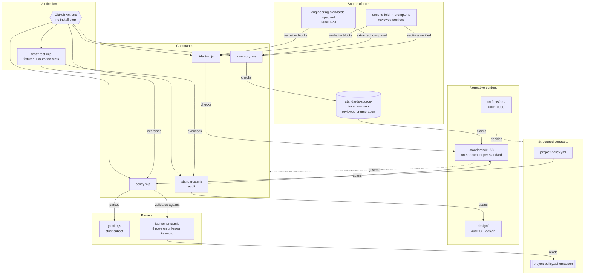

# Architecture — EngineeringStandards

> **Regenerate this document; do not hand-patch it.**
>
> It contains counts, file inventories, and structural descriptions that go stale silently. When the
> tooling changes substantially — a new script, a new detector, a changed output contract — re-run
> `/codebase-docs` rather than editing sections by hand. Patching one section leaves the rest quietly
> wrong, which is how a document drifts from *mostly right* to *confidently wrong* without anyone
> deciding it should. Small factual corrections are fine; structural change means regenerate.
>
> **Regenerating does not protect the tool's behaviour.** `codebase-docs` produces documentation
> *from* code and never produces code. If `scripts/standards.mjs` is rewritten, what protects it is
> `test/audit.test.mjs` — the tests fail if the use/mention rule is dropped, whereas prose explaining
> that rule would simply be rewritten away. The rule is therefore also a requirement in
> [`design/standards-audit-cli.md`](../design/standards-audit-cli.md), the document any
> reimplementation would be built from.
>
> **The diagram source is [`architecture.mmd`](architecture.mmd)**, embedded below. It is canonical;
> any rendered SVG is a generated artifact ([ADR 0003](../artifacts/adr/0003-mermaid-is-the-canonical-diagram-source.md)).
> Never hand-edit a render.

> A repository of 53 numbered engineering standards, plus the command-line tooling that checks
> repositories — including this one — against them. Each standard is a normative Markdown document
> stating what compliant work must look like; the executable procedure that carries a standard out
> generally lives outside this repository as a global Claude Code skill. The audience is the
> repository owner and any AI agent working in a project that claims to follow these standards.

This is a documentation repository with a small toolchain in it. It has **no database, no HTTP API,
no background jobs, no user interface, and no third-party dependencies.** Those sections are omitted
rather than filled with "none", except where their absence is a design decision worth recording.

## Diagram



**No `.svg` render is committed.** Rendering requires `@mermaid-js/mermaid-cli`, which pulls a
headless browser and would end this repository's zero-dependency property. The embedded block above
renders natively in GitHub and most viewers, so the reader sees the diagram from its canonical source
with nothing in between. This is a declared not-applicable, with the reasoning in
[ADR 0003](../artifacts/adr/0003-mermaid-is-the-canonical-diagram-source.md) — not a skipped step.
Where a standalone file is needed:

```bash
npx -y @mermaid-js/mermaid-cli -i docs/architecture.mmd -o docs/architecture.svg
```

## Tech Stack

| Layer | Technology |
|---|---|
| Normative content | Markdown. `standards/` (53 numbered documents), `design/`, `artifacts/` (source spec, ADRs, plan) |
| Structured contracts | `project-policy.yml` (Standard 18), `schemas/project-policy.schema.json` (Standard 19) |
| Tooling | Node.js ≥ 18, ESM, six `.mjs` files totalling ~2,070 lines. Only `node:` builtins. **Zero third-party dependencies** |
| Tests | `node:test` + `node:assert/strict`, 47 tests across two files over 9 committed fixtures |
| CI | GitHub Actions, Node 20, **no install step** |
| Distribution | npm `bin` entry (`standards`), plus a no-install fallback via `node scripts/*.mjs` |

The zero-dependency rule is a deliberate constraint: a program whose entire output is a judgement
about another repository's hygiene cannot credibly arrive with a transitive dependency tree. It is
recorded in [`design/standards-audit-cli.md`](../design/standards-audit-cli.md), and CI has no
`npm ci` step so that adding a dependency breaks the build rather than passing unnoticed.

## Repository Contents

| Path | Holds |
|---|---|
| `standards/NN-<kebab-title>.md` | One normative document per standard, 01–53, zero-padded so listings sort numerically |
| `design/` | Forward-looking designs. Currently the audit CLI design, which is what a reimplementation would be built from |
| `schemas/` | JSON Schemas for the structured contracts |
| `project-policy.yml` | This repository's own policy — the first dogfooded instance |
| `scripts/` | The tooling below |
| `test/` | Tests and fixture repositories, including deliberately-malformed policies |
| `artifacts/prompts/` | The source specification, and item 44 as originally pasted |
| `artifacts/adr/` | Accepted decision records |
| `artifacts/standards-source-inventory.json` | The canonical, human-reviewed enumeration of the 53 standards |
| `artifacts/project-plan-breakdown/` | The plan, one file per section |
| `docs/` | This document, its diagram source, and the local CI guide |
| `ci/Dockerfile`, `compose.ci.yml` | The containerized CI environment. The image is pinned by digest, has no network, and holds a copy of the repository rather than a mount of it — see [local-ci.md](local-ci.md) |

## Commands

Five commands, all runnable identically by a developer and by CI — Standard 28 R2 requires that CI
call the same canonical commands rather than maintaining a second validation path.

### `npm run audit` — `scripts/standards.mjs` (1,144 lines)

Scans a target repository and reports what it contains and where it departs from the standards, in
human-readable or JSON form. Accepts `audit <path>`, `--dir=`, `--json`, and `--strict`. Exits `0`,
`1` (findings, under `--strict`), or `2` (invocation error).

**Its central design property is the use/mention split.** A string associated with a technology
appears both where the technology is *used* and where it is merely *named*, and conflating them
produced five separate false findings against this repository — including reporting its own pattern
tables as evidence of AWS, Stripe, and seven AI providers. The fix is structural: every file is split
into three views, and each detector reads the one that can actually establish its claim.

| View | Contents | Used for |
|---|---|---|
| `structureOf` | Code with comments removed **and string contents blanked** | Structural signals — `app.get(`, `@Scheduled`, `new Queue(`. A call is never inside a string |
| `sourceOf` | Code with comments removed, strings intact | Import matching only, because an import specifier *is* a string |
| `commentsOf` | Comment text only | `TODO`/`FIXME` markers, which are by definition a comment convention |

Findings carry an evidence label (`OBSERVED` / `INFERRED`), a severity, and a `standardRef` pointing
at the requirement anchor that produced them. `potential-*` categories are labelled `INFERRED`, and
the report states that coverage is partial — the honesty Standard 24 R4 requires.

### `npm run policy` — `scripts/policy.mjs` (236 lines)

Validates a project policy against `schemas/project-policy.schema.json`. Exit codes distinguish
**`2` — could not evaluate** (unreadable, unparseable, schema-invalid) from **`1` — evaluated and a
compliance condition failed** (an expired exception; a rule declared both not-applicable and
excepted). Malformed configuration is never reported as non-compliance.

It also recognises the legacy camelCase policy keys from the source specification and reports each
with its canonical replacement, rather than failing with an opaque pattern error. That table
(`LEGACY_ALIASES`) is a temporary tenant here; it belongs in the rule catalog once one exists.

### `npm run inventory` — `scripts/inventory.mjs` (142 lines)

Extracts the standards enumeration from the source specification and **compares it against the
committed inventory**; it never regenerates it. Extraction is ascending-only — a number below the
last accepted one is a nested list, not a standard, which matters because item 22 contains its own
1–10 list.

This script exists because a standard was once missed entirely: item 8 is the only heading written
with a Markdown prefix, a scan reported 43 standards, and the wrong count propagated into three
documents before anyone noticed.

### `npm run fidelity` — `scripts/fidelity.mjs` (135 lines)

Every block a standard claims is verbatim source must actually appear in the source. It normalises
line wrapping but not backticks or wording, and currently checks 58 claims.

This one also exists because of a specific defect, and the defect is instructive: a hand-written
check for backticks inside quoted source searched for the substring and found it happily *inside* the
backticks it was supposed to reject. It could not have caught the bug it existed to catch. The script
has since rejected a fourth instance before commit.

### `npm test`

47 tests. `test/audit.test.mjs` covers the audit against four fixture repositories; `test/policy.test.mjs`
covers the policy toolchain against five, one valid and four deliberately malformed.

## Supporting parsers

Both exist because of the zero-dependency rule, and both share one design property that is the point
rather than a detail: **they fail loudly on anything outside their supported subset.**

### `scripts/jsonschema.mjs` (185 lines)

A JSON Schema evaluator covering exactly the keywords the policy schema uses. An unsupported keyword
**throws** instead of being ignored — a validator that silently skips a constraint reports valid for
a document it never fully checked, which is Standard 24 R2's false green in its purest form.
`assertSchemaSupported` runs before every validation and is separately asserted in tests.

`format` is treated as the annotation the specification says it is and claims nothing; every
`format: date` in the schema is paired with an equivalent `pattern` that does the actual work.

### `scripts/yaml.mjs` (229 lines)

A strict YAML subset parser: nested block mappings, block sequences of mappings, scalars, `[]`,
comments. Anchors, block scalars, flow collections, documents, duplicate keys, and tabs are all hard
errors.

**Scalars are never coerced.** `standardVersion: 1.0` reaches the schema as the string `"1.0"` so its
pattern can reject it — a parser producing a number would have made that check unreachable. Type
decisions belong to the schema, not the parser.

## Data Flow

There is no request flow; the flows that matter are verification pipelines.

**Standards integrity** — `artifacts/prompts/engineering-standards-spec.md` → `inventory.mjs`
extracts headings ascending-only → compares against `artifacts/standards-source-inventory.json` →
reports missing, duplicate, unknown, title mismatches, broken `implementedBy` paths, and unclaimed
files → CI fails on any.

**Source fidelity** — `fidelity.mjs` finds blocks preceded by an explicit verbatim claim in
`standards/*.md` → normalises wrapping → asserts each appears in the source → reports unverified
claims.

**Policy validity** — `project-policy.yml` → `yaml.mjs` parses (strictly, no coercion) →
`jsonschema.mjs` validates against `schemas/project-policy.schema.json` → `policy.mjs` applies
compliance checks (expiry, classification conflicts) → exit `0`, `1`, or `2`.

**Self-audit** — `standards.mjs audit .` walks the repository, splits each file into three views,
runs detectors, and reports findings. `test/audit.test.mjs` asserts this repository produces no
error-severity findings, which is the gate CI relies on — the audit step itself is deliberately not
`--strict`, so advisory findings cannot break the build and get the step disabled.

## Key Patterns & Conventions

- **Zero dependencies, enforced structurally.** CI has no install step, so adding one breaks the
  build. See the comment in `.github/workflows/ci.yml` where an `npm ci` would go.
- **Every guard exists because of a specific defect**, and each is mutation-tested where it guards a
  known bug: reintroduce the defect, confirm the test fails, restore. A regression test never
  observed failing is an assumption.
- **Fixtures are excluded from the self-audit** via a general `SKIP_DIRS` mechanism — added after
  they were not, and the repository reported its own test data's planted defects as its own.
- **One definition of everything.** Status vocabulary lives in Standard 8
  ([ADR 0001](../artifacts/adr/0001-canonical-status-vocabulary.md)); rule identity in Standard 26
  ([ADR 0002](../artifacts/adr/0002-canonical-rule-identity.md)); diagram source in
  [ADR 0003](../artifacts/adr/0003-mermaid-is-the-canonical-diagram-source.md). Both earlier ADRs
  exist because two definitions were found coexisting.
- **Each standard carries an `## Implementation` section** stating honestly what is built, what is
  not, and why. This is the repository's largest disclosure surface and its main weakness: it is
  prose, so nothing counts it and nothing notices when it goes stale.

## Entry Points for Common Tasks

| Task | Where to start |
|---|---|
| Add a standard | `standards/NN-<kebab-title>.md`, then `artifacts/standards-source-inventory.json` and the README index |
| Add an audit detector | `scripts/standards.mjs` — pick the correct view (`structureOf` / `sourceOf` / `commentsOf`), then add a provoking and a non-provoking fixture |
| Change the policy shape | `schemas/project-policy.schema.json` first; `scripts/jsonschema.mjs` will throw if it uses an unimplemented keyword |
| Add a policy rule check | `complianceFindings` in `scripts/policy.mjs`, plus a fixture in `test/fixtures/policies/` |
| Change the diagram | `docs/architecture.mmd`, then re-embed it here. Never edit a render |
| Record a decision | `artifacts/adr/000N-<slug>.md`, and link it from the README |
| Add or change a CI check | `STAGES` in `scripts/pipeline.mjs`, then the matching step in `.github/workflows/ci.yml`. `test/local-ci.test.mjs` fails while the two disagree, in either direction |
| Submit a pull request | `.\scripts\submit-pr.ps1` — verifies this exact commit in Docker, then pushes that SHA and opens the PR |

## Known Gaps

Stated here because a reference document that omits them reads as a complete system.

- **No rule catalog** (Standard 27). The audit's rules are hardcoded detector functions with finding
  *category* ids, not the canonical rule IDs the policy uses — so the two speak different
  vocabularies.
- **The audit does not read `project-policy.yml`.** Findings are unqualified by what the project has
  declared not-applicable or excepted, which is why the output is not yet a compliance verdict.
- **No `PROJECT.md`** (Standard 6). Declared `required` in the policy and failing, deliberately
  unwaived.
- **No `VERSION` or `CHANGELOG`** (Standard 21), so nothing declares a v1.
- **No score or `status`** (Standard 30), because a score needs a denominator and a denominator needs
  the catalog.
